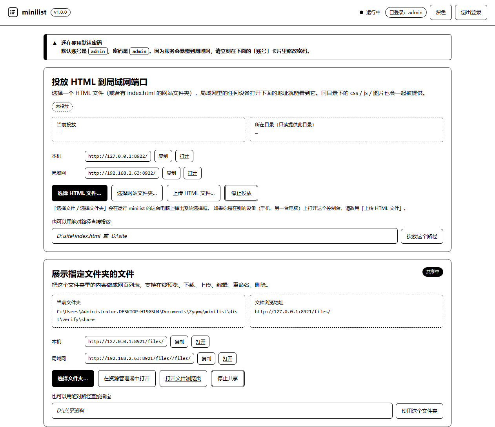
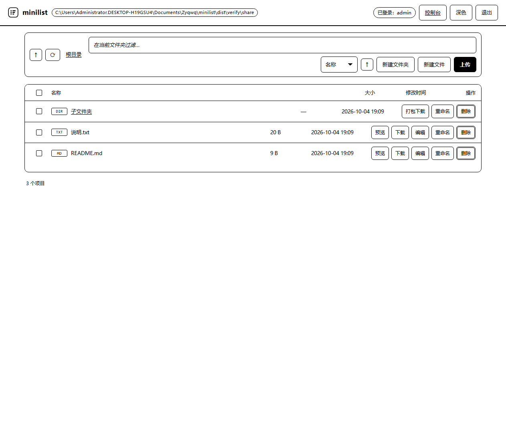

# minilist

[](#关于这个项目的作者)
[](https://github.com/Zyqwq2015/minilist/actions/workflows/ci.yml)
[](LICENSE)
[](package.json)
[](#)

把**选中的 HTML 文件投放到局域网端口**，同时把**指定的文件夹**做成网页文件列表。
支持下载、上传、在线修改、重命名、删除、打包下载；**登录后才能修改，未登录一律只读**。

界面是**严格纯黑白**的（只有 `#000` 和 `#fff`，没有灰色和彩色），打开就是一个独立的应用窗口，不是黑乎乎的命令行。

零第三方依赖，只需要 Node.js 16 以上；也可以一键**打包成单个 exe**，目标机器免装 Node、双击即用、不会弹命令行窗口。

> ### 🤖 这是 AI 写的项目
>
> 全部代码、界面、测试和文档由 **DeepSeek** 的编程智能体自动生成，人类只负责提需求和验收。
> 详细说明见 **[关于这个项目的作者](#关于这个项目的作者)**。




---

## 一、快速开始（Windows）

### 方式 A：直接下载打包好的 exe（免装 Node）

> **[⬇ 下载 minilist.exe](https://github.com/Zyqwq2015/minilist/releases/latest/download/minilist.exe)** —— 约 36 MB，双击即用，
> 不会出现命令行窗口，目标机器不需要装 Node.js。

第一次运行 Windows 可能弹 SmartScreen，点 **「更多信息」→「仍要运行」**（没有代码签名证书）。

### 方式 B：从源码跑（需要 Node.js 16+）

1. 双击 **`启动minilist.cmd`**（或 `minilist.cmd`）。
2. 会自动打开 minilist 应用窗口（纯黑白界面）。
3. 在「投放 HTML 到局域网端口」卡片里点 **「选择 HTML 文件…」**，在弹出的系统窗口里挑一个 `.html` 文件。
4. 局域网里的任何设备打开控制台里显示的 **投放地址**（例如 `http://192.168.1.5:8788/`）就能看到这个页面。

关闭：在控制台「设置」卡片里点 **「退出 minilist」**，或回到命令行窗口按 `Ctrl+C`。

### 默认登录账号

| 用户名 | 密码 |
| --- | --- |
| `admin` | `admin` |

> 因为服务会暴露到局域网，**第一次使用请立刻在控制台的「账号」卡片里改掉密码**。

---

## 二、打包成一个 exe（免装 Node、无命令行窗口）

双击 **`打包exe.cmd`**，或者在命令行里：

```bash
npm run build:exe
```

产物是 `dist\minilist.exe`（约 36 MB）。**双击它就能用**：

- **不会出现黑色命令行窗口。** 打包脚本会把 PE 头的 Subsystem 从「Console」改成「GUI」，Windows 根本不会分配控制台。
- 自动打开 minilist 应用窗口（Edge/Chrome 的应用窗口模式，没有地址栏和标签页），界面就是那个纯黑白控制台。
- 日志写在 `数据目录\minilist.log`，启动失败等异常会用**系统弹窗**提示，不会让你面对一个无声的黑框。
- 想临时看命令行输出：`minilist.exe --console`（会重新拉起一个带控制台的窗口）。
- 想保留控制台版本：`node tools/build-exe.js --console-subsystem`。

打包用的是 [pkg](https://github.com/yao-pkg/pkg)：

- 第一次打包需要联网下载 Node 基础二进制（约 40 MB），缓存在 `%USERPROFILE%\.pkg-cache`，之后可离线重复打包。
- 打包后 `data\` 和 `content\` 会生成在 **exe 旁边**；如果 exe 放在 `C:\Program Files` 这类不可写目录，会自动退到 `%LOCALAPPDATA%\minilist\`（启动时会写进日志）。
- 换目标平台：`node tools/build-exe.js --target node20-linux-x64`。

> 注意：`pkg` 的 `assets` 是相对「传入的入口」解析的。打包脚本必须传**项目目录 `.`**，
> 如果传 `src/launch.js`，前端资源一个都不会被打进去，exe 跑起来页面全是 404。

### 关于 Windows 11 的 SmartScreen

`minilist.exe` 没有代码签名证书，第一次运行时 Windows 可能弹「已保护你的电脑」。
点 **「更多信息」→「仍要运行」** 即可。介意的话就用 `启动minilist.cmd` 跑源码版本。

---

## 三、界面长什么样

界面刻意只用**两种颜色**，所有层级关系靠边框线型和反色表达：

| 视觉 | 含义 |
| --- | --- |
| 实线细框 | 一级容器（卡片、文件面板） |
| 虚线框 | 二级容器 / 未启用 / 按钮不可点（只读） |
| 双线框 | 重要操作（删除、危险按钮、成功提示） |
| 粗左边条 | 警告提示 |
| 反色块（白底黑字 / 黑底白字） | 主按钮、已开启徽标、选中项 |
| 黑白点阵抖动 | 遮罩层（代替半透明灰） |

右上角的 **「深色 / 浅色」** 就是黑白互换，两种主题都是纯黑白。



---

## 四、三个地址分别是什么

minilist 会同时监听**两个端口**，用两个端口是为了做真正的源隔离——被投放的网页拿不到控制台的接口数据，也偷不到写操作需要的令牌。

| 地址 | 作用 | 谁能访问 |
| --- | --- | --- |
| `http://<本机IP>:8787/admin/` | **控制台**：投放 HTML、选文件夹、改设置、登录 | 任何人可打开，但只有登录后才能操作 |
| `http://<本机IP>:8787/files/` | **文件浏览**：指定文件夹的网页列表 | 未登录可浏览/预览/下载；登录后才能传/改/删 |
| `http://<本机IP>:8788/` | **投放端口**：只有你选中的那个 HTML 站点 | 局域网所有人，只读 |

端口可以在控制台的「设置」里改，改完会自动重启服务。

---

## 五、功能清单

### 投放 HTML 到局域网端口
- **选择 HTML 文件…**：在运行 minilist 的这台电脑上弹出系统选择框，选中的文件成为投放站点的入口页。
  同目录下的 `css` / `js` / 图片 / 字体等相对路径资源会被一起提供，所以整站都能正常显示。
- **选择网站文件夹…**：选一个含 `index.html` 的文件夹，整个文件夹作为站点根目录。
- **上传 HTML 文件…**：从手机或另一台电脑把 HTML 传上来直接投放（适合远程操作）。
- **绝对路径直填**：懒得点选择框时，直接把 `D:\site\index.html` 粘进去。
- **停止投放**：投放端口恢复成占位页。

### 展示指定文件夹的文件
- 目录列表：名称 / 大小 / 修改时间，文件夹优先，可按名称 / 时间 / 大小 / 类型排序，可实时过滤。
- 面包屑导航、上一级、刷新。
- **上传**：按钮选择，或直接把文件拖进页面；支持多选、大文件进度显示。
- **下载**：单个下载；多选后「打包下载」；文件夹也能直接打包成 zip。
- **预览**：图片、视频、音频、PDF 直接在网页里看（支持 Range，视频能拖进度条）。
- **编辑**：文本 / 代码 / 配置 / Markdown 等文件可以在线打开编辑并保存。
  自动识别 UTF-8 / UTF-8 BOM / UTF-16 / GBK，保存时统一写回 UTF-8。
- **新建**：新建文件夹、新建文本文件。
- **重命名 / 删除**：文件和文件夹都能改名、删除（删除文件夹会连内容一起删，有二次确认）。

### 登录与权限
- 未登录 = **只读**：能看列表、能预览、能下载；所有写操作按钮都会被禁用，接口也会返回 401。
- 登录 = 可写。会话放在内存里，**重启 minilist 后需要重新登录**。
- 写操作除了 Cookie 还必须带一次性 CSRF 令牌，防止被其它端口的网页借用会话。
- 登录失败连续 8 次会锁定 60 秒。
- 密码用 scrypt + 随机盐保存，配置文件里没有明文。

---

## 六、命令行用法

```bash
node src/launch.js                       # 默认 8787 / 8788，监听 0.0.0.0
node src/launch.js --port 9000           # 换控制台端口
node src/launch.js --folder "D:\资料"     # 启动时直接指定共享文件夹
node src/launch.js --html "D:\site\index.html"   # 启动时直接投放
node src/launch.js --password 你的密码    # 设置密码
node src/launch.js --no-open             # 不自动打开界面窗口
node src/launch.js --no-app              # 用普通浏览器标签页打开
node src/launch.js --console             # 打包版上强制显示命令行窗口
node src/launch.js --help
```

只想本机用、不想暴露到局域网：在控制台「设置」里把监听地址改成 `127.0.0.1`，或者

```bash
node src/launch.js --host 127.0.0.1
```

---

## 七、自检

```bash
node test/selftest.js      # 或者在 Windows 上双击 自检.cmd
```

会在临时目录里造测试数据，用随机端口把整套服务跑起来，把
「投放 / 只读拦截 / 登录 / CSRF / 上传 / 下载 / 编辑 / 重命名 / 删除 / 打包 / 路径穿越 / 越权」
全部跑一遍，最后打印通过项数。全部通过时退出码是 0。

---

## 八、目录结构

```
minilist/
├─ 启动minilist.cmd      # Windows 双击启动（需要装 Node）
├─ 打包exe.cmd           # Windows 双击打包成单文件 exe
├─ 自检.cmd              # Windows 双击跑自检
├─ minilist.cmd          # 同启动脚本（英文文件名）
├─ package.json
├─ README.md
├─ .gitignore
├─ src/
│  ├─ launch.js          # 启动器：参数解析、开界面窗口、无控制台时安全输出
│  ├─ server.js          # 两个 HTTP 服务 + 路由 + 鉴权
│  ├─ config.js          # data/config.json 读写、口令哈希、打包后的路径切换
│  ├─ auth.js            # 会话、Cookie、登录限流
│  ├─ fsapi.js           # 共享文件夹的增删改查（含 realpath 越界防护）
│  ├─ dialog.js          # 调系统原生文件/文件夹选择框
│  ├─ multipart.js       # FormData 上传解析
│  ├─ zip.js             # 零依赖 ZIP 打包
│  ├─ mime.js            # 扩展名 -> MIME
│  ├─ paths.js           # 路径安全工具
│  └─ net.js             # 局域网地址探测
├─ public/
│  ├─ console.html/.css/.js   # 控制台（纯黑白）
│  ├─ browse.html/.css/.js    # 文件浏览（纯黑白）
│  ├─ base.css, ui.js         # 公共样式与工具
│  └─ logo.svg, favicon.svg
├─ test/selftest.js      # 端到端自检（41 项）
├─ tools/build-exe.js    # 打包脚本（含 PE 子系统补丁）
├─ docs/                 # 界面截图
├─ dist/                 # 打包产物 minilist.exe（自动生成）
├─ data/config.json      # 运行时生成：端口、投放目标、共享文件夹、口令哈希
└─ content/              # 默认共享文件夹 + 上传投放的 HTML 存档
```

---

## 九、接口一览

只读接口匿名可用，其余全部需要「已登录 + `X-CSRF-Token`」。

| 方法 | 路径 | 说明 |
| --- | --- | --- |
| GET | `/api/session` | 当前登录状态 + 公开信息 |
| POST | `/api/login` `/api/logout` | 登录 / 退出 |
| GET | `/api/state` | 完整个状态（需登录） |
| POST | `/api/publish/path` | 按绝对路径投放 |
| POST | `/api/publish/upload` | 上传 HTML 并投放 |
| POST | `/api/publish/clear` | 停止投放 |
| POST | `/api/share/folder` `/api/share/clear` | 设置 / 取消共享文件夹 |
| POST | `/api/pick` | 弹出系统原生选择框 |
| POST | `/api/open-folder` | 在资源管理器里打开 |
| POST | `/api/settings` | 改端口 / 监听地址 / 标题 / 上传上限 |
| POST | `/api/password` | 改用户名或密码 |
| POST | `/api/restart` `/api/shutdown` | 重启 / 退出 |
| GET | `/api/files?path=` | 列目录 |
| GET | `/api/download?path=` | 下载（文件夹自动打包） |
| GET | `/api/raw?path=` | 内联预览（支持 Range） |
| GET | `/api/zip?path=&name=a&name=b` | 打包下载 |
| GET | `/api/text?path=` | 读取文本内容 |
| POST | `/api/upload?path=` | 上传 |
| POST | `/api/mkdir` `/api/newfile` `/api/rename` `/api/delete` `/api/save` | 新建 / 改名 / 删除 / 保存 |

---

## 十、安全说明

- 所有路径都先归一化并做「是否在共享根之内」校验，再对真实路径做 `realpath` 复检，符号链接也跳不出共享根。
- 被投放的网页跑在**另一个端口**上，与控制台不同源；它无法读取控制台接口的响应，也拿不到 CSRF 令牌，因此不能在你不注意时删文件。
- 在文件浏览页内联预览 HTML / SVG 这类「会执行的内容」时，会额外加 `Content-Security-Policy: sandbox`，把它们隔离到独立源。
- 会话 Cookie 是 `HttpOnly` + `SameSite=Strict`。因为是局域网明文 HTTP，没有加 `Secure`。
- 局域网内没有 HTTPS，密码在网络上不是加密传输的。只在信任的网络里使用。

---

## 十一、常见问题

**局域网上的其它设备打不开？**
1. 确认控制台「设置」里监听地址是 `0.0.0.0`。
2. Windows 第一次监听时防火墙会弹窗，必须选「允许访问」（专用网络）。
3. 确认手机/另一台电脑和这台机器在同一个网段，没有被公司网络或访客隔离。
4. 用运行 minilist 这台机器的 `ipconfig` 里的 IPv4 地址，不要用 `127.0.0.1`。

**端口被占用？**
minilist 会自动往后找 30 个可用端口并在控制台显示实际端口；也可以在「设置」里手动指定。

**点「选择 HTML 文件」没有反应？**
那个选择框是在**运行 minilist 的这台电脑**上弹出的。如果你在别的设备上操作控制台，请改用「上传 HTML 文件…」。另外系统里需要有 Windows PowerShell（Windows 自带）。

**中文文件是乱码？**
编辑时会自动尝试 UTF-8 → GBK 回退。如果显示正常但保存后别的软件打不开，说明原文件是 GBK，minilist 统一按 UTF-8 保存了，请用支持 UTF-8 的软件打开。

**想换默认共享文件夹？**
点「选择文件夹…」，或直接改 `data/config.json` 里的 `sharedFolder`。

**打包报错 / 卡在下载？**
打包器需要从 GitHub 拉 Node 基础二进制。公司网络或代理拦了 github.com 时，
设好 `HTTPS_PROXY` 再重试；也可以手动把基础二进制放进 `%USERPROFILE%\.pkg-cache`。
脚本会先试 `@yao-pkg/pkg`（node20），失败自动回退到 `pkg@5.8.1`（node18），
实测回退那条更稳。实在打包不了不影响使用，双击 `启动minilist.cmd` 一样跑。

**exe 双击后什么都没出现？**
GUI 版本没有控制台，出错时会弹系统对话框告诉你原因（最常见的还是端口被占用）。
想看到完整命令行输出，运行 `minilist.exe --console`，或者看 `数据目录\minilist.log`。

**exe 怎么退出？**
在应用窗口的控制台「设置」卡片里点 **「退出 minilist」**。
如果没有窗口了，用任务管理器结束 `minilist.exe` 即可。

**exe 的配置存到哪了？**
默认存在 exe 旁边的 `data\config.json`。如果 exe 在 `C:\Program Files` 等不可写目录，
会自动存到 `%LOCALAPPDATA%\minilist\data\config.json`。

**为什么界面完全没有颜色？**
这是刻意的：整套 UI 只用 `#000` 和 `#fff` 两个色值，
层级靠边框线型（实线/虚线/双线）和反色块表达。
右上角「深色 / 浅色」就是黑白互换，没有第三种颜色。

---

## 关于这个项目的作者

**本项目由 AI 生成，人类只负责提需求和验收。**

| 项目 | 说明 |
| --- | --- |
| 生成方式 | AI 编程智能体端到端完成：需求拆解 → 后端 → 前端 → 测试 → 打包 → 文档 |
| AI 提供方 | **[DeepSeek](https://www.deepseek.com/)** |
| 使用模型 | `deepseek-flash` / `DeepSeek-V4.1-Flash` |
| 运行环境 | DeepSeek Harness（带工具调用的编程智能体） |
| 生成时间 | 2026 年 10 月 |
| 人类参与 | 提出需求、确认关键取舍、验收结果 |

### 这意味着什么

**做得比较扎实的地方：**

- 41 项端到端自检（`node test/selftest.js`），覆盖投放、只读拦截、登录、CSRF、
  上传、在线编辑、重命名、删除、ZIP 打包、路径穿越、跨端口越权。
- CI 在 Ubuntu / Windows + Node 18/20/22 上自动跑这些测试。
- Windows exe 是**实际启动验证过**的，不是"应该能跑"。
- 界面用无头浏览器截图逐项核对过；纯黑白是硬约束，全站只有 `#000` 和 `#fff` 两个色值。

**你仍然需要自己注意的地方：**

- AI 生成的代码不保证没有缺陷，用于生产环境前请自行审查。
- 安全相关的部分（scrypt 口令哈希、会话、CSRF 令牌、realpath 越界防护）虽然写了测试，
  但这**不等于经过安全审计**。
- minilist 本身**没有 HTTPS**，只应在可信的局域网里使用。

### 怎么复现这些结论

```bash
node test/selftest.js          # 后端 41 项端到端自检
node src/launch.js --no-open   # 起服务，自己点一遍
node tools/build-exe.js        # 重新打包 exe
```

---

## 许可证

[MIT](LICENSE) © 2026 朝暮枝枝